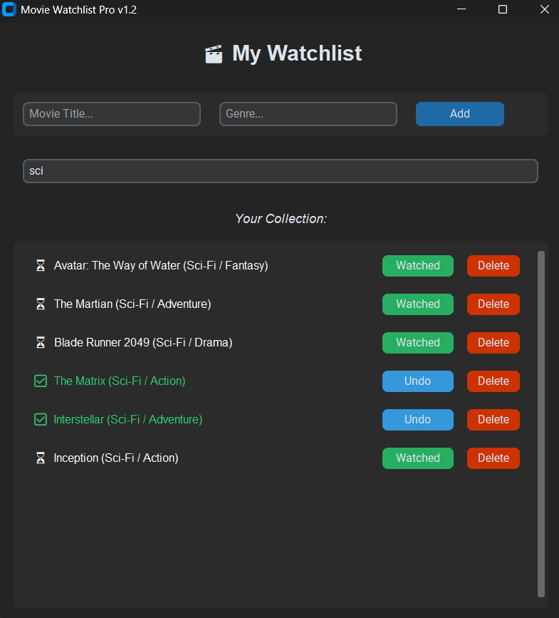

# 🎬 Movie Watchlist Pro v1.2



A modern, lightweight, and user-friendly Movie Tracking Application built with **Python**, **CustomTkinter**, and **SQLite**. This project allows users to manage their personal cinema collection with a sleek, high-performance dark-themed interface.

## ✨ Key Features

- **Modern & Aesthetic UI:** Developed using CustomTkinter for a responsive and premium dark-mode experience.
- **SQLite Database Integration:** Local data persistence ensures your movies stay saved even after the application is closed.
- **Real-time Search:** A dynamic filtering system that updates your list instantly as you type.
- **Status Tracking:** Easily toggle movie status between "Watched" and "Pending" with a single click.
- **Visual Feedback:** Color-coded status updates (Green for Watched) and dynamic emojis for better UX.
- **Full CRUD Operations:** Add, view, update, and delete entries with ease.

## 🛠️ Tech Stack

* **Language:** Python 3.x
* **GUI Framework:** [CustomTkinter](https://github.com/TomSchimansky/CustomTkinter)
* **Database:** SQLite3
* **Icons:** Unicode Emojis

## 🚀 Installation & Usage

### 1. Prerequisites
Ensure you have Python installed on your system. You can install the required library using:

```bash
pip install customtkinter

```

###  Running the Application
Navigate to the project directory and run:

```bash
python main.py


## 📂 Project Structure

Plaintext

├── main.py            # Main application source code
├── README.md          # Project documentation
└── movies.db          # Local SQLite database (Auto-generated)


